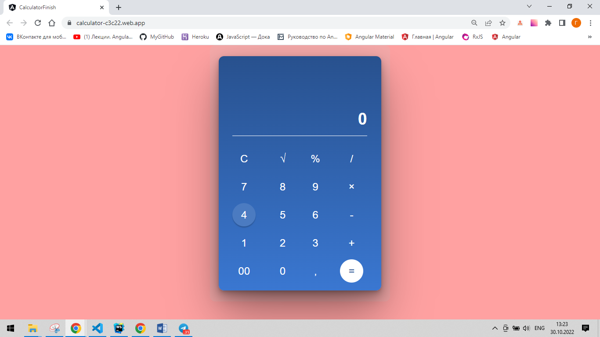
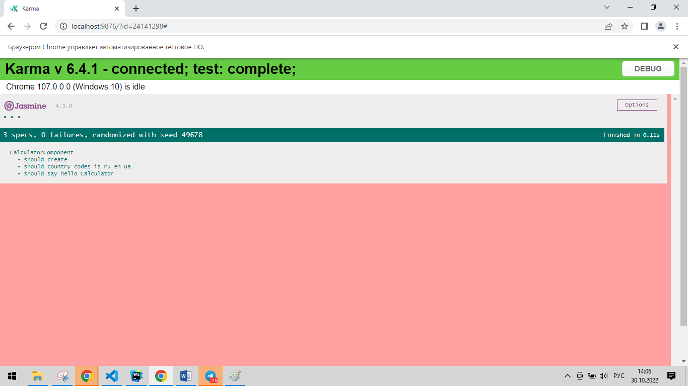

# Тестовый проект "Web-Калькулятор"

Демо этого проекта можно посмотреть [здесь](https://calculator-c3c22.web.app)

## Сборка и запуск проекта

Сборка и запуск приложения осуществляется через команду `npm start`. По умолчанию используется порт`http://localhost:4200/`. При корректировке кода все изменения будут подтягиваться автоматически.

## Запуск unit-тестирования

Команда `ng test` запускает unit-тестирование приложения через [Karma](https://karma-runner.github.io).

## Запуск angular-eslint

Команда `npm run lint` запускает angular-eslint.

